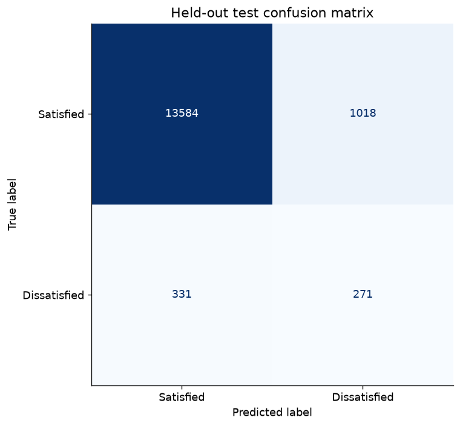

# Customer Satisfaction: PCA, Regularization and Boosting

Built a reproducible customer-satisfaction benchmark on 76,020 records, comparing regularization, PCA and gradient boosting. Used duplicate-aware partitions and training-only preprocessing to prevent leakage. The selected gradient-boosting model achieved held-out ROC-AUC 0.836 versus 0.779 for the same-split logistic baseline, with average precision improving from 0.142 to 0.194. Documented the limits of accuracy on a highly imbalanced target.

## When 96% accuracy is not enough

Most records describe satisfied customers. A classifier could predict the majority class every time and look impressive on accuracy while missing nearly every dissatisfied customer. The useful question is whether the model can rank the rarer cases above the rest.

The experiment starts with regularized logistic regression, tests whether PCA helps, then compares boosting. Duplicate predictor rows are kept together across splits so memorized copies cannot inflate test performance.

The strongest result is a better ranking model, not a finished intervention system. ROC-AUC and average precision improved against the same-split baseline. Very low minority recall at the default threshold is visible in the confusion matrix and remains a practical limitation.

## Status

Executed successfully; measured results saved.

## Method

Compared regularized logistic regression, 128-component PCA plus logistic regression, and histogram gradient boosting. Identical predictor rows stay in the same partition, including rows with conflicting labels. Scaling, feature filtering and PCA are fitted on training data. The validation partition selects the model by ROC-AUC; the selected model is refitted on development data and evaluated on the held-out test partition.

## Measured results

| Model | Accuracy | Balanced accuracy | Macro F1 | ROC-AUC |
|---|---:|---:|---:|---:|
| L2 logistic baseline | 0.9602 | 0.5031 | 0.4964 | 0.7795 |
| PCA128 + L2 | 0.9603 | 0.5039 | 0.4980 | 0.7810 |
| HistGradientBoosting leaves15 | 0.9605 | 0.5017 | 0.4932 | 0.8357 |


## Limits and interpretation

The target is rare: a majority-only classifier already achieves about 96% accuracy. Report ROC-AUC and average precision, not accuracy as evidence of strong detection. At the default 0.5 threshold, minority recall remains very low; operational threshold/cost calibration is future work. The historical cross-validation score is not directly comparable to this new test split.

## Data

Supply the Santander Customer Satisfaction training CSV with TARGET, optional ID, and numeric predictor columns. The dataset is not redistributed. Obtain it under the competition rules: https://www.kaggle.com/competitions/santander-customer-satisfaction/data

## Reproduce

Run from this project directory in an isolated Python environment. The tabular projects were executed with Python 3.12; the deep-learning projects used Python 3.11 on CPU.

```shell
python -m venv .venv
# Activate .venv using your shell's activation command.
python -m pip install -r requirements.txt
python train.py --data data/train.csv --out results
```

`analysis.ipynb` is an executed results-review notebook. It displays saved outputs by default; its optional training cell can rerun the experiment after the dataset path is configured. Training scripts were executed separately to produce the recorded results. Raw datasets, downloaded encoders and trained model files are excluded from Git. Only load model files you created or trust.

## Files

- `train.py` or `analyze.py`: complete experiment or analysis.
- `common.py`: metric, figure and reproducibility helpers.
- `results/metrics.json`: measured outcomes, data fingerprint and environment.
- `results/*.csv` and `results/*.png`: aggregate tables and figures.
- `analysis.ipynb`: reproducible review and optional rerun instructions.
- `project-description.md`: LinkedIn-ready description and skills.

## Integrity checks and prediction

```shell
python -m unittest discover -p "test_*.py"
python predict.py --input data/new_customers.csv --output predictions.csv
```

Checks cover duplicate/conflicting-label split integrity.

## Figures


## Attribution

Portfolio project by Nourah Alotaibi. This package refactors the collected project into a new reproducible workflow. Dataset providers, upstream libraries and pretrained-model authors retain their respective rights. This repository does not grant a new license to third-party data or models.

## Follow-up: turn ranking into an explicit decision

The original model at threshold 0.5 flagged only 2 of the 602 dissatisfied test examples. A follow-up chose an illustrative threshold of **0.1376** by maximizing minority-class F1 on four-fold, group-disjoint out-of-fold development predictions. Test labels did not choose the threshold.

| Operating point | Dissatisfied recall | Dissatisfied precision | Overall accuracy | Flagged records |
|---|---:|---:|---:|---:|
| Default 0.5 | 0.33% | 100.00% | 96.05% | 2 |
| Development-selected F1 threshold | 45.02% | 21.02% | 91.13% | 1289 |

The new threshold finds 271 of 602 dissatisfied examples but also flags 1,018 satisfied examples. Balanced accuracy increases to 0.690 and minority-class F1 to 0.287. ROC-AUC stays unchanged because only the decision rule changes. This makes the precision/recall tradeoff explicit; it is not a validated business-cost policy.

**Evaluation boundary:** this is a follow-up on the previously reported test set, not fresh independent validation. The selection procedure uses development data only, but a future deployment should validate the rule on a new period.

```shell
python threshold_analysis.py --data data/train.csv --model models/model.joblib --out results
python predict.py --input data/new_customers.csv --threshold 0.137553 --output predictions.csv
```




Full metrics: `results/threshold_analysis.json` and `results/threshold_test_comparison.csv`.
